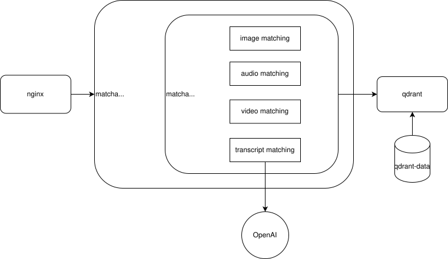
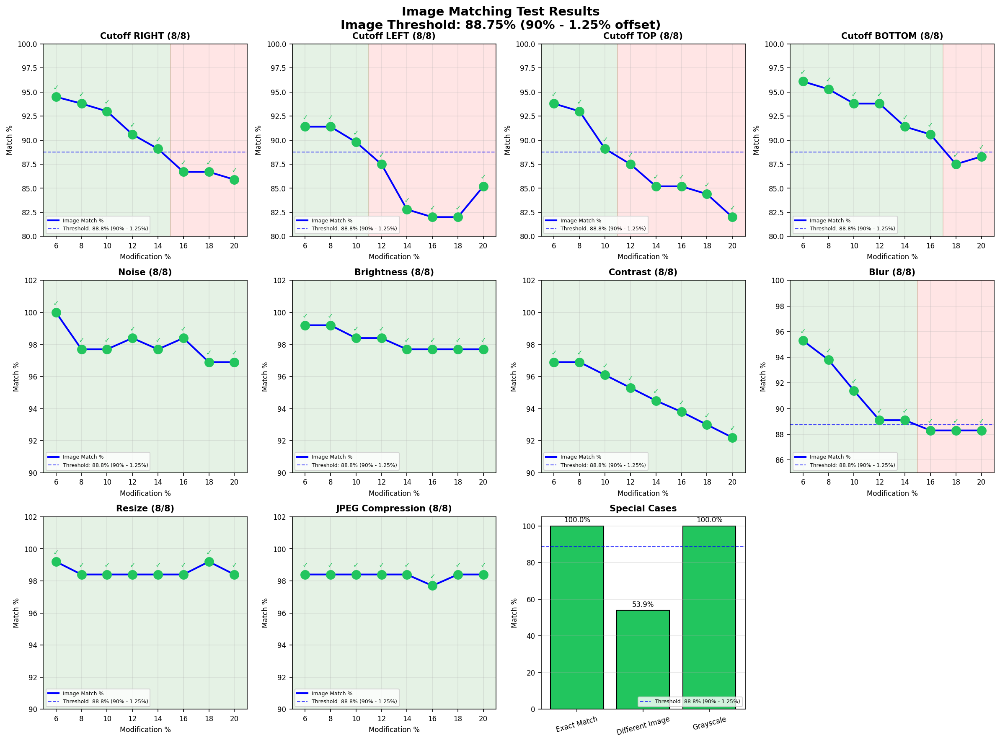
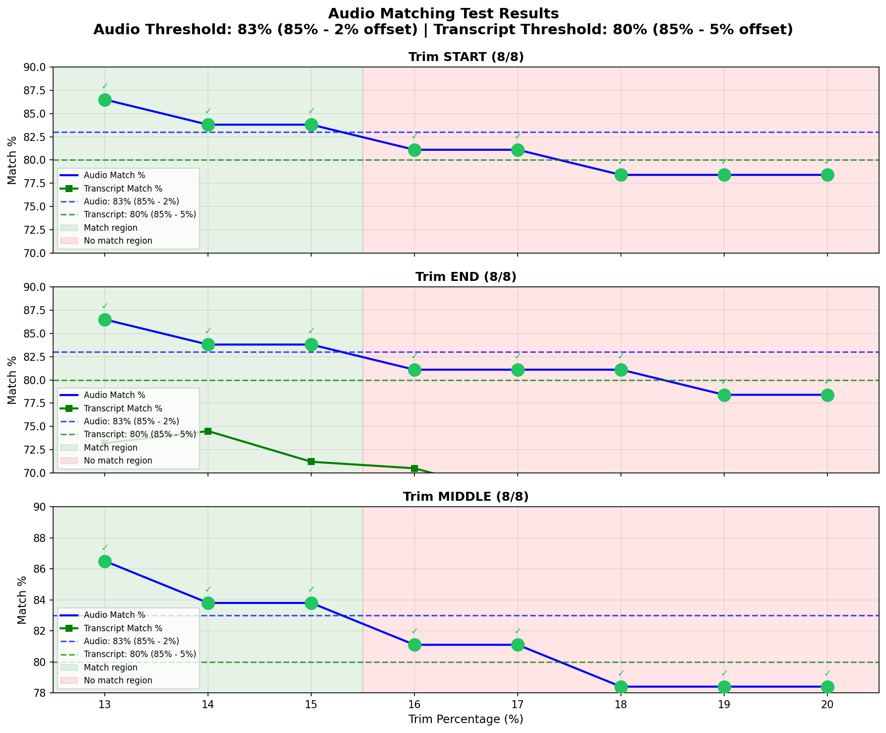
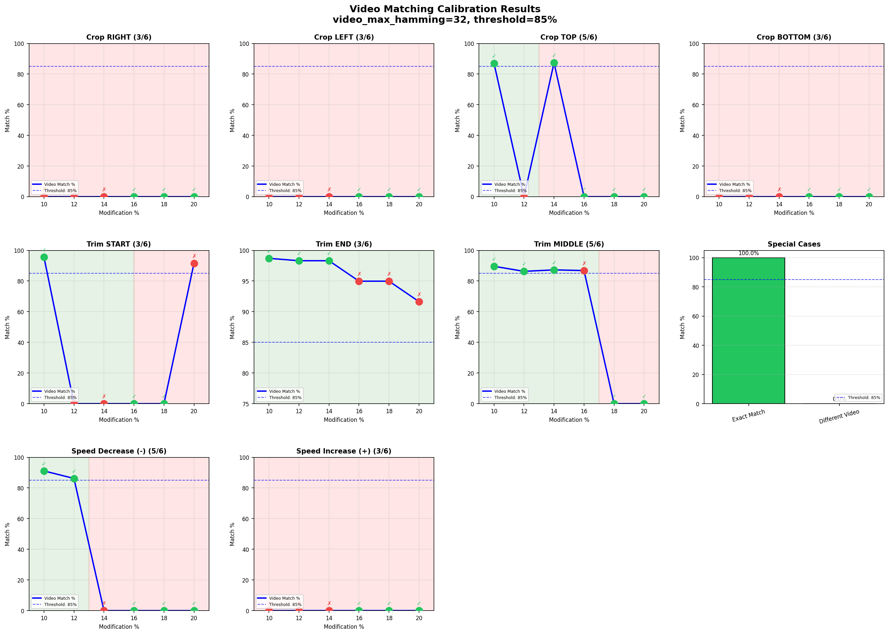
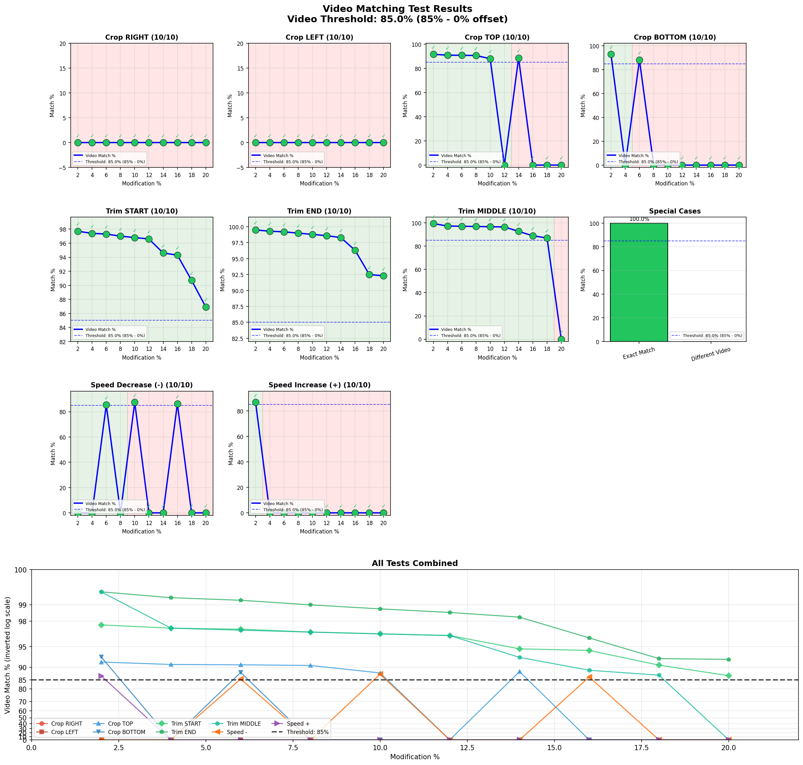

# Matcha

Matcha is a `Docker`-based media matching system using perceptual hashing (`pdqhash` for images/video and `chromaprint` for audio), OpenAI `whisper` transcription, and `qdrant` vector search.

Where exact hashing only recognizes byte-identical files, Matcha recognizes media that has been altered — cropped, trimmed, re-encoded, pitch-shifted, blurred, or stamped with a logo — and still traces it back to the original. This makes it a building block for deduplication, copyright and brand protection, and tracking the spread of known content across platforms.

- **Robust to manipulation**: near-matches survive crops, trims, logo overlays, compression, brightness/contrast changes and pitch shifts that defeat cryptographic hashes.
- **Multi-modal by design**: video is matched independently on frames, audio and transcript — a heavily cropped video still matches through its unchanged soundtrack.
- **Fast at any scale**: media of any length is reduced to compact fingerprints and matched via vector search instead of pairwise comparison, so lookup cost stays flat as the index grows.
- **Ready to operate**: a two-endpoint API (`/hash`, `/match`), per-request tunable thresholds, multi-tenant project isolation, and calibrated defaults backed by an automated test suite.

The system is vertically scalable by increasing `Uvicorn` workers in each container, and horizontally scalable by increasing the amount of concurrent Docker containers. Incoming requests are load-balanced by `nginx` to all available containers via round robin. Qdrant supports concurrent reading and writing.



```bash
make help # lists make commands
```

## Quick Start

```bash
make docker-run    # start services
make examples      # run example matches
```

## Thresholds

| Media | `exact_match`    | `near_match`    | `no_match` | 
|-------|------------------|-----------------|------------|
| image | 100% identical SHA256 hash   | 99,99% - 83% image match (7% variance from 90% threshold) | <83% match |
| audio | 100% identical SHA256 hash  | 99,99% - 85% audio match (0% variance from 85% threshold) | <85% match |
| video | 100% identical SHA256 hash  | 99,99% - 80% video or audio match (5% variance from 85% threshold) | <80% match |

Due to its non-linear variance, transcript matches have no impact on matches.

## Run

### Local

```bash
make install # installs requirements.txt
make dev     # runs matcha locally and a Qdrant container
```

### Docker

```bash
make docker-run     # runs nginx, four matcha containers (4 workers each = 16 workers) and Qdrant
```

## API

All [examples](./examples) shown below can be executed using `make examples`.

### Hashing

Hashing returns a SHA256 `item_id` for future reference.

#### Image

A 256-bit PDQ hash is generated.

```bash
curl -X POST http://localhost:8000/hash \
  -F "file=@examples/image/jerusalem.jpg"
```

Response:

```json
{
  "item_id": "88a626272c42010aa899324af53654690030259c0d07304eb0f01a890de02f7f",
  "type": "image",
  "indexed": true,
  "num_video_hashes": 1,
  "num_audio_segments": 0,
  "has_transcript": false,
  "project": null
}
```

#### Audio

One chromaprint fingerprint is generated for every 0.5 seconds of audio. SimHash splits transcript text into overlapping 3-character chunks (3-grams), each hashed to 256 bits. By voting on each bit position, a single fingerprint is generated, enabling fast matching via hamming distance.

```bash
curl -X POST http://localhost:8000/hash \
  -F "file=@examples/audio/armstrong.mp3"
```

Response:

```json
{
  "item_id": "7df9b697eb7e725b2f67c8992ee014ab4eb3c8f6c68854e4763ed71e375d7003",
  "type": "audio",
  "indexed": true,
  "num_video_hashes": 0,
  "num_audio_segments": 118,
  "has_transcript": true,
  "project": null
}
```

#### Video

One 256-bit PDQ hash is generated per second of video. If an audio stream is available, chromaprint and SimHash fingerprints are generated as well.

```bash
curl -X POST http://localhost:8000/hash \
  -F "file=@examples/video/armstrong.mp4"
```

Response:

```json
{
  "item_id": "df6d9510c6e5658ed0feeb4b56b44238e63b0aa306be9019bfd615ab9328f0c1",
  "type": "video",
  "indexed": true,
  "num_video_hashes": 62,
  "num_audio_segments": 118,
  "has_transcript": true,
  "project": null
}
```

### Matching

Matching finds similar media in the database.

#### Image

Image hashes within a certain Hamming distance are considered similar.

Exact match (same file):

```bash
curl -X POST http://localhost:8000/match \
  -F "file=@examples/image/jerusalem.jpg"
```

```json
[{"item_id": "88a626272c42010a...", "status": "exact_match", "image_match_percent": 100.0}]
```

Near match (cropped):

```bash
curl -X POST http://localhost:8000/match \
  -F "file=@examples/image/jerusalem_crop.jpg"
```

```json
[{"item_id": "88a626272c42010a...", "status": "near_match", "image_match_percent": 89.1}]
```

Near match (logo overlay):

```bash
curl -X POST http://localhost:8000/match \
  -F "file=@examples/image/jerusalem_logo.jpg"
```

```json
[{"item_id": "88a626272c42010a...", "status": "near_match", "image_match_percent": 93.0}]
```

No match (different image):

```bash
curl -X POST http://localhost:8000/match \
  -F "file=@examples/image/dog.png"
```

```json
[]
```

#### Audio

Audio segments are matched via fingerprint similarity, then scored using a hybrid alignment approach: offset-based alignment groups segments by temporal displacement to handle continuous trims (start/end), while sliding window alignment (10 segments, 50% overlap) finds local alignments to handle discontinuous edits (middle cuts). Both methods contribute matched segments, and the best offset-based, sliding window, or hybrid score is returned.

Exact match (same file):

```bash
curl -X POST http://localhost:8000/match \
  -F "file=@examples/media/armstrong.mp3"
```

```json
[{"item_id": "7df9b697eb7e725b...", "status": "exact_match", "audio_match_percent": 100.0, "transcript_match_percent": 100.0}]
```

Near match (trimmed - 10s from start):

```bash
curl -X POST http://localhost:8000/match \
  -F "file=@examples/media/armstrong_trim.mp3"
```

```json
[{"item_id": "7df9b697eb7e725b...", "status": "near_match", "audio_match_percent": 89.0, "transcript_match_percent": 56.6}]
```

Near match (pitch shifted):

```bash
curl -X POST http://localhost:8000/match \
  -F "file=@examples/media/armstrong_pitch.mp3"
```

```json
[{"item_id": "7df9b697eb7e725b...", "status": "near_match", "audio_match_percent": 97.5, "transcript_match_percent": 99.5}]
```

No match (different audio):

```bash
curl -X POST http://localhost:8000/match \
  -F "file=@examples/media/house.mp3"
```

```json
[]
```

#### Video

Each query frame is searched against indexed frames within a hamming threshold, and then matches are grouped by video. If matched frames / total frames exceeds the video threshold, it's considered a match.

Exact match (same file):

```bash
curl -X POST http://localhost:8000/match \
  -F "file=@examples/media/armstrong.mp4"
```

```json
[{"item_id": "df6d9510c6e5658e...", "status": "exact_match", "video_match_percent": 100.0, "audio_match_percent": 100.0, "transcript_match_percent": 100.0}]
```

Near match (trimmed - 10s from start):

```bash
curl -X POST http://localhost:8000/match \
  -F "file=@examples/media/armstrong_trim.mp4"
```

```json
[{"item_id": "df6d9510c6e5658e...", "status": "near_match", "video_match_percent": 80.2, "audio_match_percent": 82.2, "transcript_match_percent": 50.0}]
```

Near match (cropped - audio unchanged):

```bash
curl -X POST http://localhost:8000/match \
  -F "file=@examples/media/armstrong_crop.mp4"
```

```json
[{"item_id": "df6d9510c6e5658e...", "status": "near_match", "video_match_percent": 1.4, "audio_match_percent": 100.0, "transcript_match_percent": 100.0}]
```

Near match (logo overlay - audio unchanged):

```bash
curl -X POST http://localhost:8000/match \
  -F "file=@examples/video/armstrong_logo.mp4"
```

```json
[{"item_id": "df6d9510c6e5658e...", "status": "near_match", "video_match_percent": 4.3, "audio_match_percent": 100.0, "transcript_match_percent": 100.0}]
```

No match (different video):

```bash
curl -X POST http://localhost:8000/match \
  -F "file=@examples/video/smith.mp4"
```

```json
[]
```

### Custom Thresholds

Override default thresholds per request:

```bash
curl -X POST "http://localhost:8000/match?image_threshold=0.80&image_offset=0.10" \
  -F "file=@examples/media/jerusalem_crop.jpg"
```

The `offset` fine-tunes the threshold to maximize true-positive matches within the above-mentioned values.

| Parameter | Default | Description |
|-----------|---------|-------------|
| `image_threshold` | 0.90 | Minimum similarity for image match |
| `image_offset` | 0.0125 | Variance below threshold still accepted |
| `audio_threshold` | 0.85 | Minimum similarity for audio match |
| `audio_offset` | 0.02 | Variance below threshold |
| `video_threshold` | 0.85 | Minimum similarity for video match |
| `video_offset` | 0 | Variance below threshold |
| `transcript_threshold` | 0.85 | Minimum similarity for transcript match |
| `transcript_offset` | 0.05 | Variance below threshold |

### Projects

Projects offer multi-tenant isolation. Items in one project are invisible to other projects.

```bash
# Index to project
curl -X POST "http://localhost:8000/hash?project=client_a" \
  -F "file=@examples/media/jerusalem.jpg"

# Match within same project (found)
curl -X POST "http://localhost:8000/match?project=client_a" \
  -F "file=@examples/media/jerusalem.jpg"
# Returns: [{"item_id": "88a626272c42010a...", "status": "exact_match", ...}]

# Match in different project (not found)
curl -X POST "http://localhost:8000/match?project=client_b" \
  -F "file=@examples/media/jerusalem.jpg"
# Returns: []
```

### Other Endpoints

```bash
# Statistics (as required by DevOps)
curl http://localhost:8000/stats
curl "http://localhost:8000/stats?project=client_a"

# Delete item
curl -X DELETE "http://localhost:8000/item/88a626272c42010a..."

# Reset index
curl -X POST http://localhost:8000/reset
curl -X POST "http://localhost:8000/reset?project=client_a"
```

## Test

```bash
make docker-run  # start services
make test        # runs all tests
```

### By Type

```bash
make test-image
make test-audio
make test-video
```

### With Plots

```bash
make test-image-plot
make test-audio-plot
make test-video-plot
```

### Results

Various hashing algorithms and offsets have been tested to maximize the amount of passing test cases.

#### Image

10% image cut-offs and blur are detected with some variance, possibly leading to a small amount of false positives or overly strict matching. Contrast, brightness, noise, size changes and JPEG compression are reliably detected.



#### Audio

15% audio cut-offs are detected reliably with some variance. Transcript matches are not reliably detected due to variance that does not allow linear thresholding.



#### Video

Video cropping, trimming as well as speed increases and decreases were [tested](./calibration/video/) across 3/4 of all possible Hamming distances. A Hamming distance of 32 covered the most test cases.



PDQ detects cropping, trimming and speed changes at different sensitivities, leading to variying amounts of matches at different Hamming distances. Tighter Hamming distances lead to less false positives and stricter matching, which seems reasonable when also comparing audio.



## Design

### Architecture

- **Docker**: Databricks clusters weren't reliably executing code, and `vpdq` did not build properly.
- **nginx**: The main user of this system is the labelling solution that runs `n` concurrent notebooks.
- **Qdrant**: Pinecone does not support vector search based on Hamming distances.
- **pdqhash**: vpdq's Python API does not build around its CLI. pdqhash does, and uses the same C libraries. Comparing both resulted in the same results.

### Transcription

None of these alternative approaches were further pursued after being thoroughly tested.

- **N vectors per n-gram**: Does not scale (1 transcript → 250 vectors stored, 256 separate Qdrant searches per query. 10K transcripts = 2.5M vectors).
- **MinHash + LSH**: Jaccard penalizes size differences; 13% trim gave ~40% match instead of ~87%; required in-memory LSH index
- **Word 3-gram shingles + SHA256**: SHA256 is cryptographic, not locality-sensitive. Single character difference = ~128 bit hamming difference. Hamming threshold are meaningless.
- **Word 2-gram shingles**: More fragile to transcription variation. If Whisper says "lorem" vs "lorum", all shingles break.
- **sentence-transformers**: Semantic text search, not syntactic/exact matching, uncontrollable variance.


## Recommendations

1. The Qdrant database could be prepared for production by being deployed as a continuous service, and without an unprotected endpoint to delete all of its contents at once.
2. A real-world labelling project could further refine thresholds and offsets.
3. OpenAI transcript hashing variance is too high to offer further insights. Audio fingerprinting is more reliable. OpenAI transcript hashing and matching could be removed.
4. The Docker system could be ported to a Databricks notebook, and scaled without a load balancer.
5. Audio variance could be decreased to avoid flakey tests.
6. Thresholds for each project and modality could be re-assessed in regular intervals based on manually labelled random subset of all matched items.