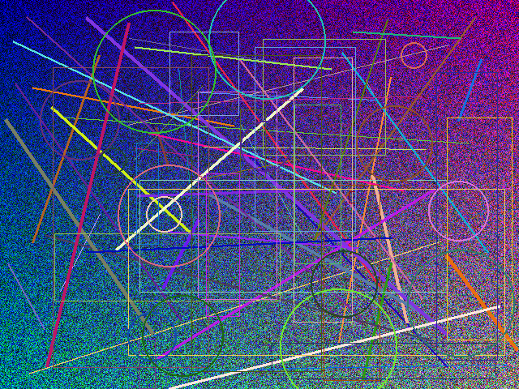

# Media matching and media hashing
This `Docker` container uses `pdqhash` for perceptual hashing, `whisper` for transcription, `datasketch` for Min- and Local Sensitivity Hashing (LSH), `chromaprint` for audio fingerprinting and a `FAISS` index to `exact_match`, `near_match` and `no_match` images, audio and video.



## Build
```bash
docker build -t matcha .
```

## Run
Copy `.env.example` to `.env`, and add an `OPENAI_API_KEY`.
### Local
```bash
sudo apt-get update && sudo apt-get install -y \
    ffmpeg \
    libchromaprint-tools \
    espeak
```
```bash
pip install -r requirements.txt
```
```bash
uvicorn main:app --reload
```

### Docker
```bash
docker run -d \
  --name matcha \
  -p 8000:8000 \
  --env-file .env \
  matcha
```
```bash
curl http://localhost:8000/health
```

## Usage
### Hashing
```bash
curl -X POST http://localhost:8000/hash \
  -F "file=@video.mp4"
```
```json
{
  "item_id": "a1b2c3d4e5f6...",
  "type": "video",
  "num_video_hashes": 20,
  "num_audio_segments": 35,
  "num_transcript_segments": 12,
  "transcript_text": "Full transcript text..."
}
```

### Matching
```bash
curl -X POST http://localhost:8000/match \
  -F "file=@query.mp4"
```

#### Optional query parameters
| Parameter | Type | Default | Description |
|-----------|------|---------|-------------|
| `image_threshold` | float | 0.90 | Min % of image hashes that must match (0.0-1.0) |
| `video_threshold` | float | 0.85 | Min % of video frames that must match (0.0-1.0) |
| `audio_threshold` | float | 0.85 | Min % of audio segments that must match (0.0-1.0) |
| `transcript_threshold` | float | 0.85 | Min transcript similarity (0.0-1.0) |
| `image_hamming_distance` | int | 28 | Max Hamming distance for images (0-256) |
| `video_hamming_distance` | int | 28 | Max Hamming distance for video frames (0-256) |
| `audio_hamming_distance` | int | 60 | Max Hamming distance for audio segments (0-256) |

#### Example with custom distances
```bash
# Image matching
curl -X POST "http://localhost:8000/match?image_hamming_distance=28" \
  -F "file=@query.png"

# Video matching
curl -X POST "http://localhost:8000/match?video_hamming_distance=28&audio_hamming_distance=60" \
  -F "file=@query.mp4"
```

#### Response
```json
[
  {
    "item_id": "a1b2c3d4e5f6...",
    "status": "near_match",
    "image_match_percent": null,
    "video_match_percent": 86.0,
    "audio_match_percent": 90.0,
    "transcript_match_percent": null,
    "image_hamming_distance": null,
    "video_hamming_distance": 28,
    "audio_hamming_distance": 60
  }
]
```

#### Status values
| Status | Meaning |
|--------|---------|
| `exact_match` | All modalities at 100% |
| `near_match` | At least one modality above threshold |
| `no_match` | No matches found |

## Hamming distance calibration
Image, audio and video [calibration scripts](./calibration/) run variations of [artificially generated media](./docs/) across different hamming distances to identify optimal values for thresholds of 90% for images and 85% for audio, video and transcripts.

### Run

Start application locally and
```
python calibration/calibrate_audio.py
python calibration/calibrate_image.py
python calibration/calibrate_video.py
```

### Results

Given the latest results for each modality exported [here](./calibration/results/), the following distances are recommended:

| Modality | Test cases | Distance | Accuracy | Duration | Comment
|----------|------------|----------|----------|----------|---------|
| image    | 103 | 28       | 61%      | ~9s    | Calibrated exhaustively from 0-30
| audio    | 57 | 60       | 56%      | ~23m      | Calibrated only with 60 with 3s segment sizes and 0.5s hops; requires more testing with larger and smaller distances (20, 30, 40, 50, 70, 80, 90, 100); segment and hop size seem reasonable
| video    | 145 | 28/60       | 51%        | ~45m        | Calibrated only with 28 for video and 60 for audio; additional combinations of audio and image distances after testing both modalities individually could be further tested

Transcripts are shingled at size 3, and LSH candidates retrieved at a threshold of 0.5. Both value are common.

Exhaustively calibrated distances should be set as defaults in `.env` and [config](config.py).